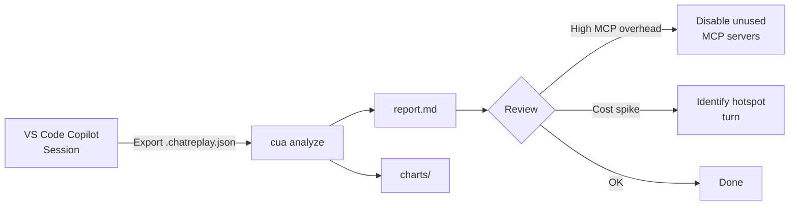
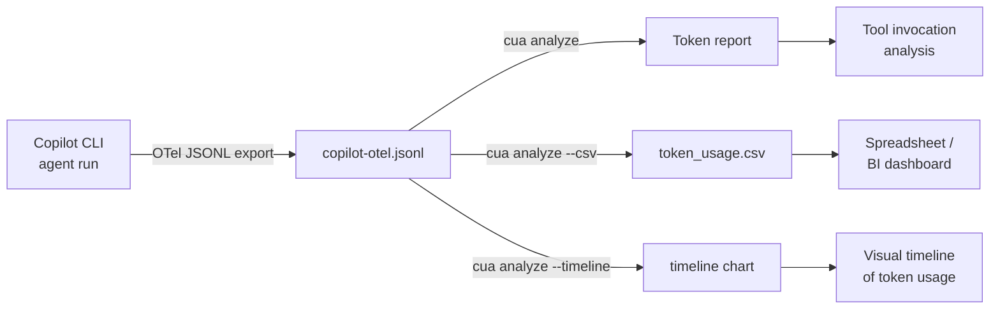
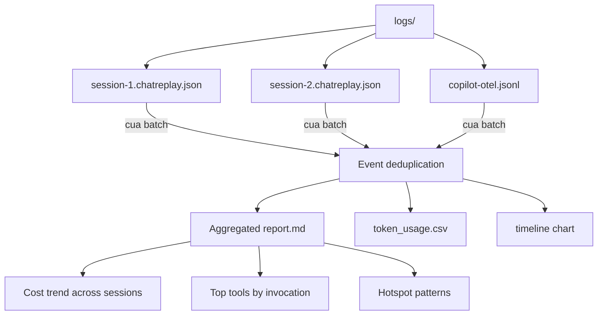
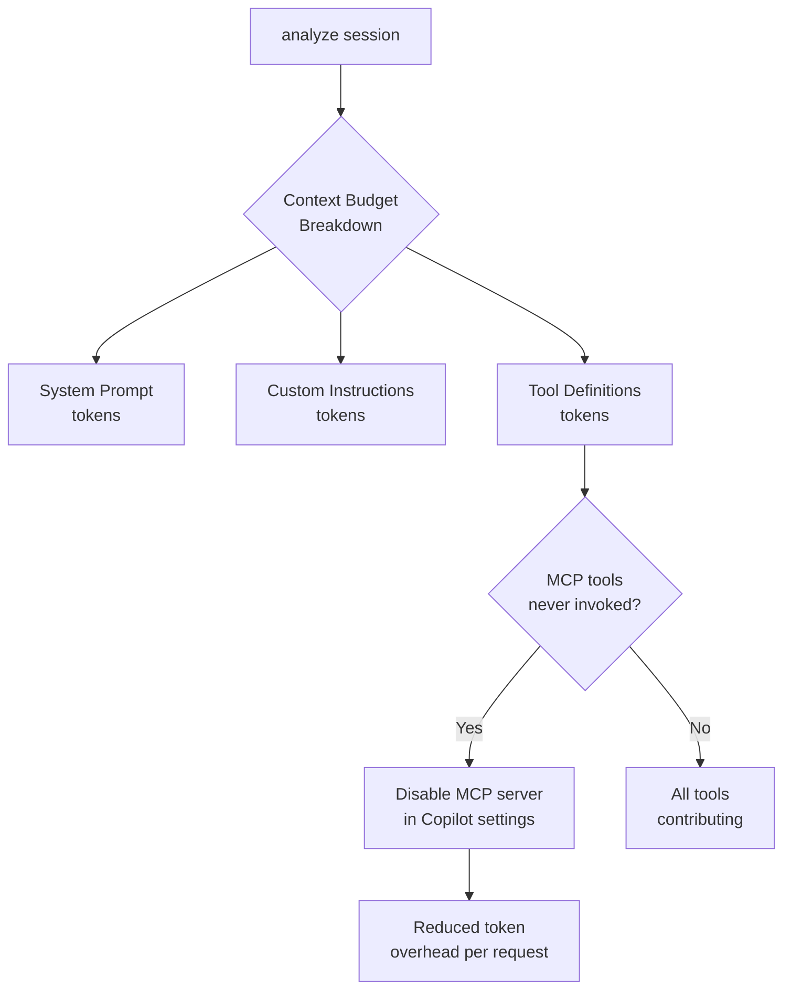
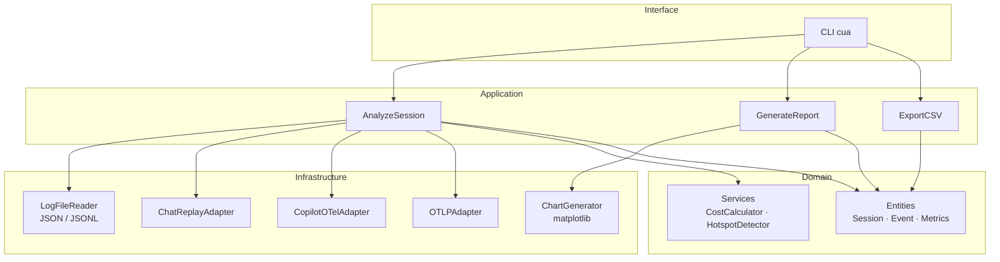
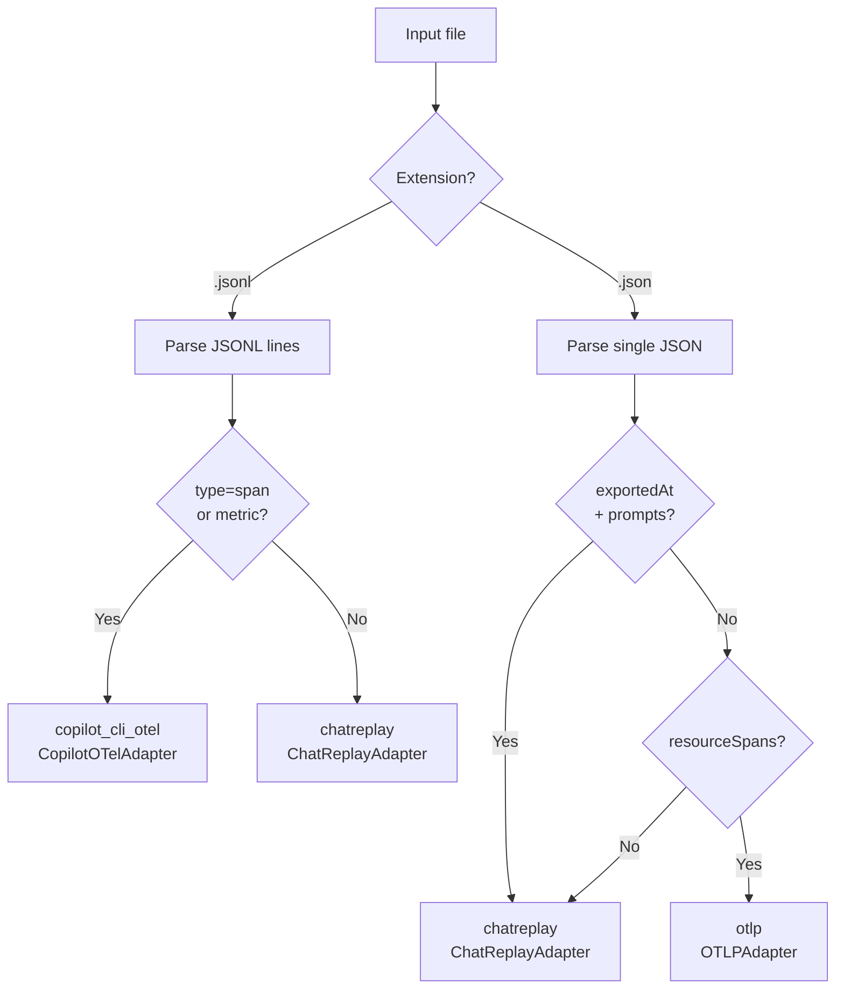

# Copilot Usage Analyzer

A command-line tool to analyze GitHub Copilot Agent Debug Logs and generate comprehensive usage reports with insights and recommendations.

Supports two log formats:
- **VS Code ChatReplay** (`.chatreplay.json`) — exported from the VS Code Agent Debug panel
- **Copilot CLI OTel JSONL** (`.jsonl`) — exported from the Copilot CLI via OpenTelemetry

---

## Features

- **Multi-format support**: Parse both VS Code ChatReplay and Copilot CLI OTel JSONL logs
- **Token Analysis**: Detailed breakdown of input, output, and cached tokens per model/turn
- **Cost Estimation**: Calculate AI credits and USD costs based on plan and per-model pricing
- **Context Budget Breakdown**: Estimate overhead from system prompt, custom instructions, and tool definitions
- **Tool Availability vs Usage**: See which tools were registered vs actually used — with MCP savings recommendations
- **Timeline Chart**: Visualize token usage over time with labeled data points
- **CSV Export**: Machine-readable full event breakdown aligned with report columns
- **Hotspot Detection**: Identify anomalous usage patterns and high-cost turns
- **Batch Mode**: Aggregate and deduplicate events across multiple log files
- **Multiple Report Types**: Executive, summary, and detailed Markdown reports with charts

---

## Supported Input Formats

| Format | Extension | Source | Context Budget |
|--------|-----------|--------|---------------|
| VS Code ChatReplay | `.chatreplay.json` | VS Code Agent Debug panel → Export | Full (system prompt + tools) |
| Copilot CLI OTel | `.jsonl` | Copilot CLI `COPILOT_OTEL_FILE_EXPORTER_PATH` | Tool definitions only |

---

## Installation

### From Source
```bash
git clone https://github.com/Amadeus-xDLC/github.copilot-usage-analyser.git
cd github.copilot-usage-analyser
pip install -e .
```

### Development Installation
```bash
pip install -e ".[dev]"
```

---

## Exporting Logs

### VS Code ChatReplay

1. Enable in VS Code settings:
   ```json
   "github.copilot.chat.agentDebugLog.enabled": true,
   "github.copilot.chat.agentDebugLog.fileLogging.enabled": true
   ```
2. Open the Agent Debug panel (ellipsis `...` → **Show Agent Debug Logs**)
3. Click the **Export** (download) icon → save the `.chatreplay.json` file

### Copilot CLI OTel JSONL

```bash
# Write OTel spans/metrics to a local JSONL file
COPILOT_OTEL_FILE_EXPORTER_PATH=/tmp/copilot-otel.jsonl copilot <command>

# Optionally capture full prompt/response content
OTEL_INSTRUMENTATION_GENAI_CAPTURE_MESSAGE_CONTENT=true \
COPILOT_OTEL_FILE_EXPORTER_PATH=/tmp/copilot-otel.jsonl copilot <command>
```

See `copilot help monitoring` for the full list of OTel environment variables.

---

## Quick Start

```bash
# Analyze a VS Code ChatReplay file
cua analyze session.chatreplay.json

# Analyze a Copilot CLI OTel file
cua analyze copilot-otel.jsonl

# Full analysis: report + CSV + timeline chart
cua analyze --csv --timeline session.chatreplay.json -o my_report/

# Executive summary only, no charts
cua analyze --type executive --no-charts session.chatreplay.json

# Batch analyze a directory of log files
cua batch /path/to/logs/ -o aggregated_report/

# Batch with CSV and timeline
cua batch --csv --timeline /path/to/logs/ -o aggregated_report/
```

---

## CLI Reference

### `cua analyze`

```
cua analyze [OPTIONS] FILE

Analyze a single Copilot debug log file and generate a report.

Arguments:
  FILE                           Path to .chatreplay.json or .jsonl log file

Options:
  -o, --output PATH              Output file or directory
  -t, --type [executive|summary|detailed]
                                 Report type (default: detailed)
  -f, --format [markdown|html]   Output format (default: markdown)
  -p, --plan [business|enterprise|individual]
                                 Plan type for pricing (default: business)
  -c, --config PATH              Configuration file
  --no-charts                    Disable chart generation
  --csv                          Export detailed token usage to CSV
  --timeline                     Generate timeline chart (token usage over time)
  -v, --verbose                  Verbose output
  --help                         Show this message and exit
```

### `cua batch`

```
cua batch [OPTIONS] DIRECTORY

Batch analyze all log files in a directory and aggregate into a single report.
Automatically deduplicates events across files.

Arguments:
  DIRECTORY                      Directory containing .chatreplay.json or .jsonl files

Options:
  -o, --output PATH              Output directory (default: reports)
  -p, --plan [business|enterprise|individual]
                                 Plan type for pricing (default: business)
  --no-charts                    Disable chart generation
  --csv                          Export aggregated token usage to CSV
  --timeline                     Generate aggregated timeline chart
  -v, --verbose                  Verbose output
  --help                         Show this message and exit
```

---

## Workflows and Use Cases

### Use Case 1: Single Session Review

Analyze a VS Code Copilot session to understand token spend and tool usage.



```bash
cua analyze session.chatreplay.json -o report/ --csv --timeline
```

---

### Use Case 2: Copilot CLI OTel Monitoring

Capture and analyze Copilot CLI agent runs with OpenTelemetry.



```bash
COPILOT_OTEL_FILE_EXPORTER_PATH=/tmp/copilot-otel.jsonl copilot agent run ...
cua analyze /tmp/copilot-otel.jsonl -o report/ --csv --timeline
```

---

### Use Case 3: Batch Analysis Across a Sprint

Aggregate all sessions from a directory and generate a consolidated report.



```bash
cua batch logs/ -o sprint_report/ --csv --timeline --verbose
```

---

### Use Case 4: Context Budget Optimization

Identify which tool definitions are burning tokens without being used.



**Example output** from the Context Budget report section:
```
| Component                       | Tokens (est.) | % of Avg Prompt |
|---------------------------------|---------------|-----------------|
| System Prompt (base)            | 12,543        | 14.2%           |
| Custom Instructions             | 1,205         | 1.4%            |
| Tool Definitions — Built-in (44)| 10,755        | 12.2%           |
| Tool Definitions — MCP (24)     | 5,729         | 6.5%            |
| Tool Definitions — Activators   | 3,323         | 3.8%            |
| Total Overhead                  | 33,555        | 38.0%           |
| Conversation History (net)      | ~54,790       | ~62.0%          |
```

---

## Report Structure

Generated reports contain these sections:

| Section | Description |
|---------|-------------|
| Executive Summary | High-level KPIs: total cost, credits, events, top model |
| Session Overview | Session ID, time range, duration, agent type |
| Usage Statistics | Event counts by type, tool calls, errors |
| Context Budget Breakdown | Token overhead from prompt, instructions, tool definitions |
| Tool Availability vs Usage | Which tools were registered vs invoked (per MCP server) |
| Token Analysis | Per-turn token chart (input/output/cached) |
| Model Performance | Cost and token breakdown by model and provider |
| Tool Usage | Invocation counts, success rate, avg duration |
| Hotspot Analysis | High-cost or anomalous turns with root cause hints |
| Recommendations | Actionable suggestions: disable MCP, reduce context, etc. |

---

## Architecture

The tool follows hexagonal (ports & adapters) architecture:



**Format detection flow:**



---

## Output Files

| File | Description |
|------|-------------|
| `report.md` | Main Markdown report |
| `token_usage.csv` | Full event-level CSV export (`--csv`) |
| `token_usage_timeline.png` | Timeline chart (`--timeline`) |
| `token_usage_by_model_bar.png` | Bar chart — tokens by model |
| `tool_invocation_counts_bar.png` | Bar chart — tool invocation counts |

---

## Development

### Running Tests
```bash
pytest
```

### Code Formatting
```bash
black src/ tests/
```

### Linting
```bash
ruff check src/ tests/
```

### Type Checking
```bash
mypy src/
```

---

## Contributing

Contributions are welcome! Please see [CONTRIBUTING.md](CONTRIBUTING.md) for guidelines.

## License

MIT License — see [LICENSE](LICENSE) for details.

## Acknowledgments

- GitHub Copilot team for the Agent Debug Log and OTel monitoring features
- OpenTelemetry GenAI Semantic Conventions
